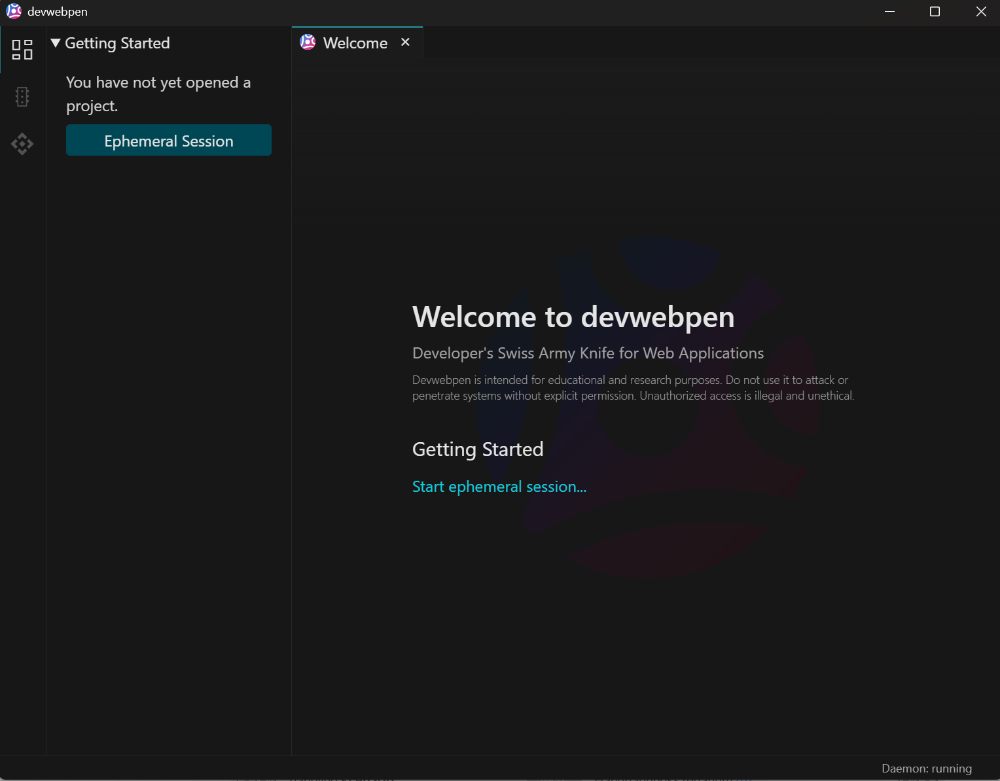
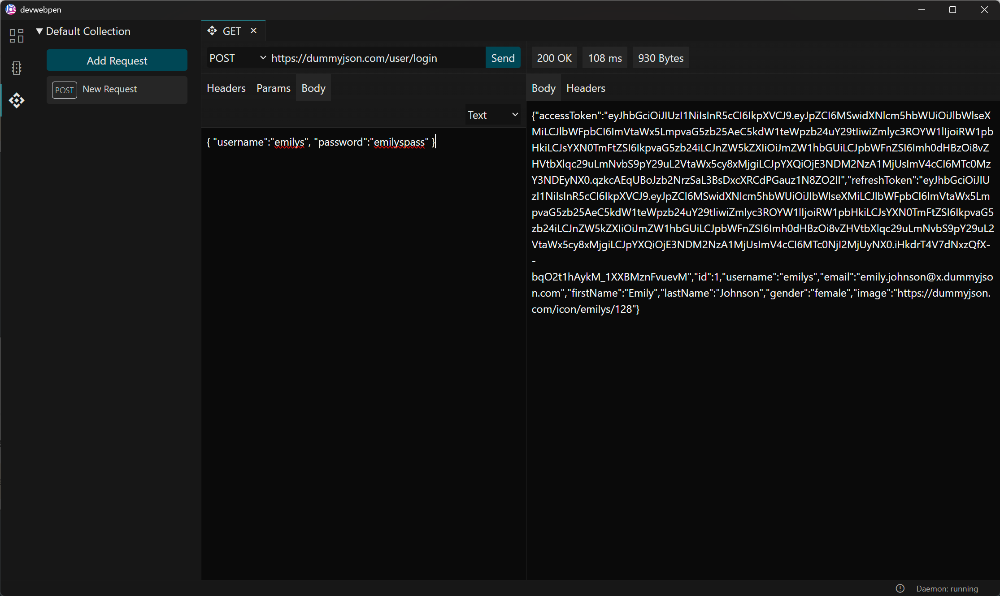
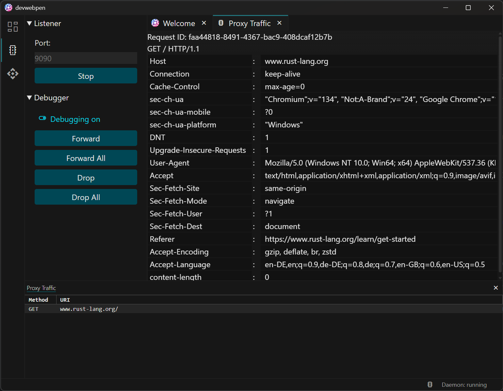

# 🌐 devwebpen: A Developer's Swiss Army Knife for Web Applications 🖊️

Devwebpen is a desktop application designed to assist developers and security professionals with common web application tasks. It aims to provide core functionalities for interacting with HTTP APIs and inspecting network traffic in a modern, user-friendly interface.

## ⚠️ Disclaimer: Experimental & Educational Project ⚠️

**devwebpen is an experimental project created for educational purposes only.** Development is not ongoing, and the project is not feature-complete or production-ready. Use at your own risk.

## Screenshots





## Getting Started

### Prerequisites

- [Tauri with Rust and Node.js](https://v2.tauri.app/start/prerequisites/)
- [Maven](https://maven.apache.org/index.html)
- [GraalVM (for daemon sidecar as native image)](https://www.graalvm.org/downloads/)

### Development Workflow

This project consists of several parts that work together:

**1. Tauri Core (Rust) & UI (React/Vite)**

- **Description:** The main desktop application shell is built with Tauri. The Rust code (`src-tauri`) handles window management, system interactions, core application logic, state management, and acts as the bridge between the UI and the Java daemon. The User Interface (`src`) is a React application built using Vite, providing the visual components and user interactions.
- **Run in Development Mode:** This command starts the Vite development server for the UI with hot-reloading and launches the Tauri application, automatically connecting them. It will attempt to launch the Java daemon sidecar (or the daemon debugger depending on the native image in `src-tauri/binaries`). In the most common debugging scenario you will have a `daemon-debugger` sidecar, therefore you'll need to start the `daemon` manually (as an additional step, see also launch config in `.vscode`).
  ```bash
  # Navigate to the project root directory
  npm run tauri:dev
  ```
- **Build for Release:** This command builds the React UI for production and then bundles it with the compiled Rust application into a native desktop executable for your platform. **Important Hint:** You'll need to make sure to include the native image of the sidecar (see section about Java daemon below).
  ```bash
  # Navigate to the project root directory
  npm run tauri build
  ```

**2. Daemon (Java)**

- **Description:** A background process (`src-daemon`) written in Java using Netty. It handles the heavy lifting for tasks like the MITM proxy server and executing API client requests. It communicates with the Tauri Rust backend via WebSockets. It's designed to be run as a sidecar managed by Tauri, compiled into a native executable using GraalVM for better performance and packaging.
- **Run in Development Mode (Standalone):** You can run the daemon directly using Maven for easier Java debugging, separate from the Tauri app. Ensure the `Main.java` is updated to run `debug_wihout_parent`.
- **Build JAR and Native Image (using GraalVM):** Consult the `README.md` in `src-daemon`.

**3. Daemon Debugger (Java)**

- **Description:** A separate utility (`src-daemon-debugger`) designed to improve the developer experience (DX) when working on the tauri app with the daemon. It connects tauri to the daemon (running in debug mode) allowing for easier testing, inspection, or sending direct commands during development.
- **Run in Development Mode:** Start the tauri app in dev mode as described above and start the daemon in debug mode, ensure the `Main.java` is updated to run `debug`.
- **Build and Native Image (using GraalVM):** Make sure the daemon debugger is in `src-tauri/binaries` (sidecar for tauri), otherwise debugging won't work.

**4. Other Dev Tools**

- Copy the daemon native image:
  ```bash
  # copy the daemon native image (the only option when you want to build a release version)
  npm run sidecar
  # XOR copy the daemon debugger native image (for development and debugging the daemon)
  npm run sidecar:debugger
  ```
- Review all scripts in `package.json` to learn about other helpers

### Related Topics

| Category | Links                                                                                                                      |
| -------- | -------------------------------------------------------------------------------------------------------------------------- |
| Desktop  | [Tauri](https://v2.tauri.app/), [Rust](https://www.rust-lang.org/), [Node.js](https://nodejs.org/en)                       |
| Web (UI) | [React](https://react.dev/), [Vite](https://vite.dev/)                                                                     |
| Java     | [GraalVM](https://www.graalvm.org/), [Maven](https://maven.apache.org/index.html)                                          |
| Security | [OWASP](https://owasp.org/projects/), [ZAP](https://www.zaproxy.org/), [PortSwigger](https://portswigger.net/web-security) |

### Recommended IDE Setup

- [VS Code](https://code.visualstudio.com/) + [Tauri](https://marketplace.visualstudio.com/items?itemName=tauri-apps.tauri-vscode) + [rust-analyzer](https://marketplace.visualstudio.com/items?itemName=rust-lang.rust-analyzer)

## Roadmap

### Currently Working (Basic Implementation)

- [x] **Core:** Application starts; Java daemon sidecar launches; ephemeral session
- [x] **API Client:** Basic request sending (Method, URL, Headers, Text-Body), response display (Status, Headers, Text-Body)
- [x] **Proxy:** Start/Stop proxy server, basic HTTPS interception, display of intercepted requests (Headers, No Body yet)

### WIP / Planned Features

- [ ] **Proxy:** Modify intercepted traffic, WebSocket interception, improved certificate handling
- [ ] **API Client:** Request history, collections, environments, authentication helpers, code generation
- [ ] **Web Spider:** Automatically crawl and map websites
- [ ] **Security Scanner:** Basic vulnerability identification
- [ ] **Encoding/Decoding Tools:** Base64, URL encoding, etc
- [ ] **Project Management:** Saving/Loading sessions or projects
- [ ] **Extensibility:** Support for plugins or scripts
- [ ] UI/UX improvements across all features

## License

Copyright © 2025 Ruslan Curbanov

Licensed under the [Apache License, Version 2.0](LICENSE).

Unless required by applicable law or agreed to in writing, software
distributed under the License is distributed on an "AS IS" BASIS,
WITHOUT WARRANTIES OR CONDITIONS OF ANY KIND, either express or implied.
See the License for the specific language governing permissions and
limitations under the License.
